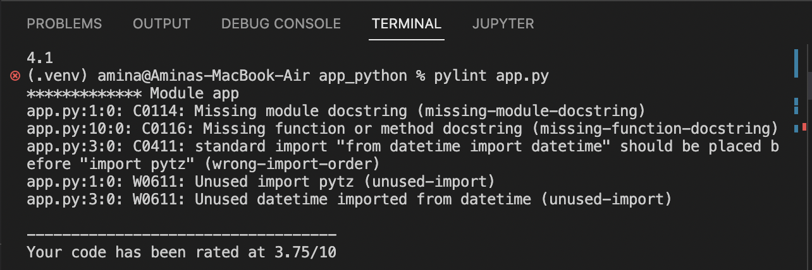

# Time App Development Proccess

The aim of this file is to describe the proccess of development a simple Python web application, that shows current time in Moscow.
While working on the project, I studied what the best practices of Python are and how the use of them will improve my project.
All best practices I have applied are written below along with an explanation of the choice of a framework (I have chosen Flask).

## Python Best Practices I Applied

### Structure of a project

There are key components of the project structure that greatly simplify its usage. Therefore, it's a good practice to spend some time creating these components. They are:

- README.md (provides an introduction to the repository files)
- src folder / actual code file
- requirements.txt (list of modules and dependencies of the project)
- setup.py (prepares for launch and distribute modules needed by the project)
- images folder
- static folder (holds styles)
- templates folder (holds html templates)

### Code style

Following the PEP-8 guideline would also be a good practice.

- Name variables and functions with relevant words, splitting them with '_' if needed:

    `lower_case_with_underscores`

- Comments should be meaningful and reasonable
- Indentation via 4 spaces
- Whitespaces around operators and assignments
- Line length maximum 79 characters
- Imports should always be on top of the file on separate lines
However, it's ok to write this:

    `from flask import Flask, render_template`

- Avoid numerous return statements in function body

### Linters

Linters help to identify mistakes in your code (such as mistyped variable names, unclosed bracket, incorrect tabbing).

### Virtual Environments

This will avoid library clashes and make it easier to work on different projects at the same time.

## Why Did I Choose Flask?

For me, the decisive factor for choosing framework was that I was developing a web application (even such a basic one as given in an assignment) for the first time.
Therefore, it was important for me to find such a framework that would be simple enough to study. Moreover, it should be the popular one, so that I could find a lot of exhaustive tutorials on it.

Since we are speaking about Python, there are three main types of frameworks: Full-Stack, Micro- and Asynchronous frameworks.
My goal was to develop a simple product app with no need to  support a wide range of libraries and databases. Also, my app wasn't supposed to handle a large set of concurrent connections. So,  expressed a preference for the use of micro-framework.

Flask is a Python-based micro framework for developing web applications. It is one of the most popular tools among both beginners and professionals. One can verify this by seeing a huge number of articles about web applications development which recommend to use Flask.

### Pros

- Easy to Use: the framework is straightforward even for a beginner (its documentation is very helpful)
- There are a lot of tutorials
- Easy-to-set-up
- Has a quick debugger
- Flexible: Flask is open to change (comparing to Django)
- Scalable: it enables to run a project smoothly even if it scales up (potentially we will grow our project)
- Supports modular programming

### Cons

- Lack of some tools: developers have to manually add extensions
- Doesn't cope with too many extentions: may slow down the app due to a multitude of requests
- Using more modules could increase the security risk (if a malicious module is included)
- Community support is smaller (comparing with Django)

## Linters That I Used

### The Pylint

While choosing linters for Python, I desided to select the Pylint. It finds some programming and stylistic errors (invalid code constructions) and tries to enforce a coding standard. Moreover, Pylint allows to customize it to our needs (output only the errors that are the most important for us).

I was pleasantly surprised to receive an exhaustive description of all the mistakes made.

So I could easily analyze and correct them:

### markdownlint

As for Markdown, I chose the most appropriate one - the markdownlint. It is an extension for the Visual Studio Code editor, so the installation was very easy for me.
markdownlint includes a library of rules to encourage standards and consistency for Markdown files. Any lines that violate one of markdownlint's rules trigger a Warning in the editor:

